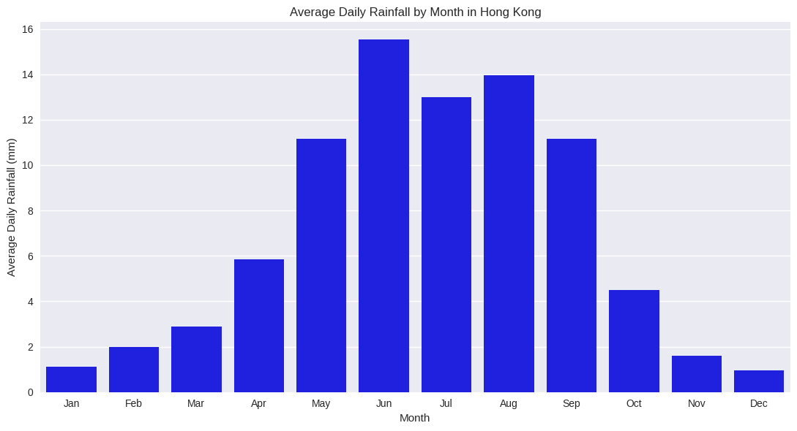
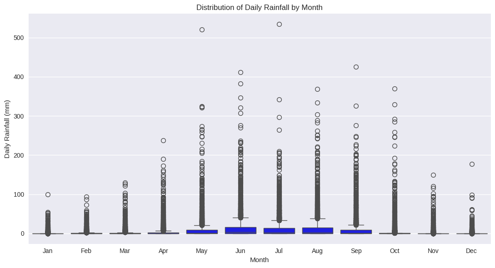

# Hong Kong Rainfall Exploratory Analysis

This mini project explores long-term rainfall patterns in Hong Kong using publicly available daily rainfall data from the Hong Kong Observatory (HKO). It was completed as a small self-initiated exercise to strengthen my interest in meteorology-oriented data analysis and practical weather data interpretation.

## Project Overview

Using Python, I cleaned and analyzed historical daily rainfall records and created visualizations to examine seasonality, variability, and long-term annual patterns in Hong Kong rainfall.

## Data Source

- Hong Kong Observatory (HKO) open data
- Daily total rainfall dataset from DATA.GOV.HK

## Tools Used

- Python
- pandas
- matplotlib
- seaborn
- Google Colab

## Project Tasks

- Loaded and inspected the raw rainfall dataset
- Reconstructed the table structure from the source file
- Cleaned year, month, day, and rainfall values
- Created a proper date variable for analysis
- Calculated monthly average rainfall
- Visualized annual rainfall variability
- Examined the distribution of daily rainfall by month

## Visualizations

### 1. Average Daily Rainfall by Month
This chart shows clear rainfall seasonality in Hong Kong, with much wetter conditions from late spring to early autumn.

### 2. Annual Total Rainfall in Hong Kong
This chart shows that annual rainfall varies substantially across years, indicating noticeable interannual variability.

### 3. Distribution of Daily Rainfall by Month
This boxplot shows that wet-season months have both higher rainfall levels and greater variability, including extreme outliers.

## Key Findings

- Rainfall in Hong Kong is strongly seasonal.
- Average daily rainfall peaks during the summer months.
- Wet-season rainfall is more variable and includes more extreme daily rainfall events.
- Total annual rainfall changes considerably from year to year.

## Motivation

This project reflects my growing interest in combining data analytics with meteorological data. As a student in Business Computing and Data Analytics, I wanted to build a small but relevant project that demonstrates data cleaning, exploratory analysis, visualization, and interpretation using real-world weather data.

## Files

- `rainfall_analysis.ipynb` — main notebook
- `monthly_rainfall.png` — monthly average rainfall chart
- `annual_rainfall_final.png` — annual rainfall chart
- `seasonality_boxplot.png` — monthly rainfall distribution chart

## Note

For the annual rainfall visualization, a suspicious partial-year record was excluded to avoid misleading interpretation of the long-term pattern.

## Charts

### Average Daily Rainfall by Month

### Annual Total Rainfall in Hong Kong

### Distribution of Daily Rainfall by Month

